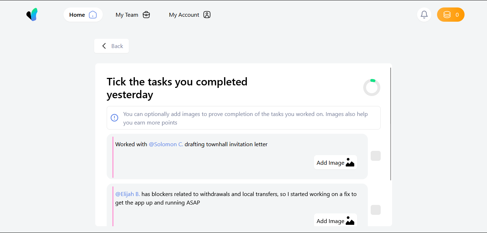

# Frontend task

### This project was built using Vite + React + TypeScript.

*Table of Contents*

- [Introduction](#introduction)
  - [Overview](#overview)
  - [Structure](#structure)
- [Functionalities](#functionalities)
- [Conclusion](#conclusion)

### Introduction
This project is done in the fulfuilement of the task given to me to complete.
This is how the structure of the application looks at build



#### Overview
The core of this project is built using React-TypeScript, TailwindCSS and ContextAPI. It prioritises both core design, and the supposed functionalies expected of the system to perform.

The layout of the application was primarily done on the Firefox brower, and has been viewed across Microsoft Edge, and Google chrome. The reasons for this, is to ensure cross-browser functionality, whilst maintaing the code standard.

The project was bootstrapped using `yarn`

#### Structure
As all standard react codes are written, the core component exists, and is displayed at the main. Now, the folder arrangement for this outline is;

```
|- public
  |- images
|- src
  |- assets
  |- components
  |- utils
```
The main components that make up the code structures, are contained in the `components`. This is to ensure that these components can be tussled, and reused wherever they are needed.

The `utils` folder contains functions and utilities which would be used accross the application, which would limit writing of some functions, making easier to manage some processes.

The `assets` are supposed to hold assets which would be used in the building of the layout, but... they are put in the `public` folder for easy reach and use.

### Functionalities
Now, in this application, there are certain functionalities which have been made, following the interactions seen and gotten from the way the figma design looks. they are;

- **Nav Toggle:** now, based on the observation from the design, it is supposed that clicking the Navigation items should be able to render a new display. This is done, although there is nothing in those displays, only indicator that you are in that display. This was implemented using prop communications between components, and the use of the `switch case` function to enable a back and forth toggle and render of components.

- **Back Button:** as interpreted in the design, the back button should go back to the previous screen. This is implemented using the `useCallback` hook in React. This is to ensure the smooth use of the interface. In more complex applications, it would be implemented with much scalable and roboust code.

- **Checkbox interactions:** upon checking the box, from the design, I noticed it changes the side color of the task to be done. This is implemented by the use of the `useState` hook, so as to understand and create an interaction between the color change and the checkbox click, when it transitions from `false` to `true`.

- **Adding Images:** Now, it is noticed that image could be added to buttress a particular point for that particular task. This is where the `utils` folder comes in, as it contians the `addImage` function where the `useContext` hook was used to create a universal provider, which could communicate transversly and smoothly through the application without much hassle and decrease the need for props. However the images do not save to local storage, and would be unmounted after a refresh. Also, a `removeImage` function was added, as to remove the selected image if you want to change it.

- **Circular progress:** This was by far the trickiest part of the entire display, as the circular progress needed to be created from scratch, so as to give the feel, as the `meter` tag could not be used to perform that function. This was done by mounting the state using the `useEffect` hook, then passing the `tasks` state to it so it would be updated as the checkboxes are toggled.

- **Responsiveness:** I noticed there was a design made for the mobile screen, and it's implementation, so using `TailwindCSS` made working on the responsiveness easier and managable.

- **Coin Increase:** I noticed between the two frames *mobile* & *desktop*, that there was a significant increase between the values on the orange-like button at the top right of the frame. So, an increase counter was implemented as the button is being clicked.

- **Side Navigation:** as the navigation items are not being displayed on the navigation bar, I assumed there should be such. So, for implementation, I used the `logo image` as the toggle for the side navigation. this happens accross all `tablets` and `mobile phones`, and would still render the components as required, as they operate with the same measure as the side nav.

Another core integration which was made, was rendering accurately the dummy tasks as was created. This was done by creating a `state`, using the `useState` hook, which held the tasks, and the `dangerouslySetInnerHTML`, which was used so as to render the text appropriately, which the predetermined stylings (*would not be done under normal circumstances, as measures for that would be handled server-side*).

### Conclusion
This task was done to be able to cover all functionality provided, and to be able to create the design to be pixel perfect. The design was done with with the variable HTML5 tags, and straight forward and concise functions to maximise functionality, enhance code readablity and code maintenance